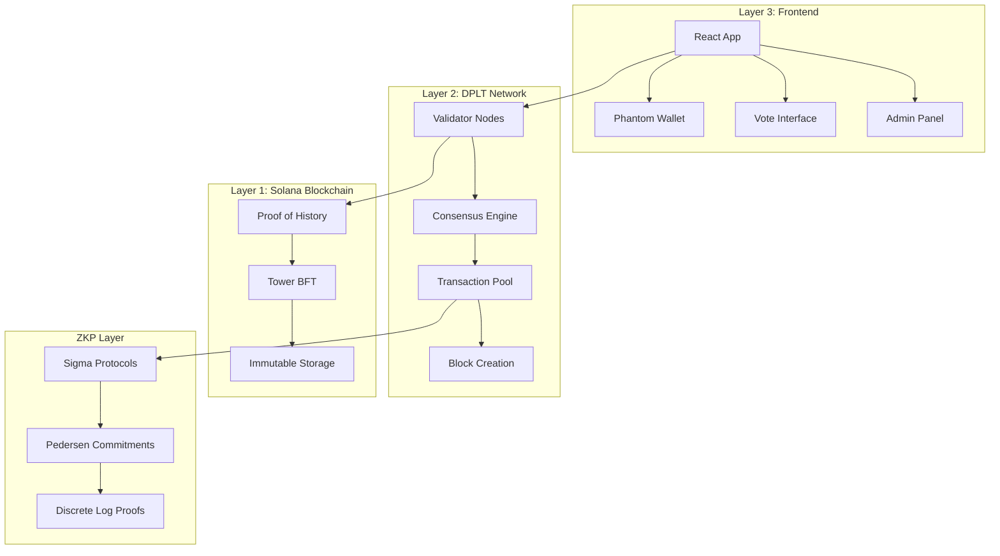

# 🗳️ Blockchain E-Voting System

<div align="center">
  

[](https://solana.com)
[](https://reactjs.org)
[](https://nodejs.org)

**A secure, transparent, and privacy-preserving electronic voting system powered by blockchain technology**

[🚀 Quick Start](#-quick-start) • [📋 Features](#-features) • [🏗️ Architecture](#️-architecture) • [🔒 Security](#-security) • [📖 Documentation](#-documentation)

</div>

---

## 🌟 Overview

This project implements a revolutionary **three-layer blockchain e-voting system** that solves the fundamental challenges of traditional digital voting: **speed**, **privacy**, and **verifiability**. Built with cutting-edge cryptographic techniques and distributed ledger technology.

### ✨ Key Innovations

- 🚀 **Sub-10-second vote processing** through custom DPLT consensus
- 🔐 **Cryptographic vote privacy** using Zero-Knowledge Proofs
- 🌍 **Global verifiability** via Solana blockchain integration
- 🛡️ **Byzantine fault tolerance** with multi-layer security
- 📱 **User-friendly interface** with wallet integration

---

## 🏗️ System Architecture

<div align="center">



</div>

### 🔧 Technology Stack

| Component | Technology | Purpose |
|-----------|------------|---------|
| **Frontend** | React 18, Tailwind CSS | User interface & wallet integration |
| **Backend** | Node.js, Express.js | API server & business logic |
| **Blockchain** | Solana devnet | Immutable transaction storage |
| **Consensus** | Custom DPLT | Fast transaction validation |
| **Privacy** | Zero-Knowledge Proofs | Vote privacy preservation |
| **Cryptography** | secp256k1, Ed25519 | Digital signatures & commitments |

---

## 📋 Features

### 🗳️ Core Voting Features
- ✅ **Secure voter registration** with age verification
- ✅ **Real-time election management** by authorized administrators  
- ✅ **Multiple voting modes**: Standard and Zero-Knowledge Privacy
- ✅ **Instant vote verification** with cryptographic proofs
- ✅ **Live results dashboard** with interactive charts
- ✅ **Vote audit trail** on public blockchain

### 🔒 Security Features
- 🛡️ **Multi-layer validation** (DPLT + Solana)
- 🔐 **Zero-Knowledge vote privacy** (optional)
- 🌐 **Distributed consensus** with fault tolerance
- 🔑 **Cryptographic verification** for all operations
- 📝 **Immutable audit logs** on Solana blockchain
- 👤 **Role-based access control** for administrators

### 💼 Administrative Features
- 📊 **Election management dashboard**
- 📈 **Real-time network monitoring** (DPLT status)
- 🔧 **Network recovery tools** for consensus issues
- 📋 **Voter registry management**
- 📊 **Detailed analytics** and reporting

---

## 🚀 Quick Start

### Prerequisites

- **Node.js** (v16+)
- **npm** or **yarn**
- **Phantom Wallet** browser extension
- **Solana CLI** (optional, for advanced features)

### 🛠️ Installation

1. **Clone the repository**
   ```bash
   git clone https://github.com/yourusername/blockchain-evoting.git
   cd blockchain-evoting
   ```

2. **Install dependencies**
   ```bash
   # Install server dependencies
   cd server
   npm install
   
   # Install client dependencies  
   cd ../client
   npm install
   ```

3. **Environment Setup**
   ```bash
   # Create server environment file
   cd server
   cp .env.example .env
   
   # Configure environment variables
   # SOLANA_NETWORK=devnet
   # WALLET_PATH=path/to/your/wallet.json
   # PROGRAM_ID=your_program_id
   ```

4. **Start the application**
   ```bash
   # Terminal 1: Start server
   cd server
   npm start
   
   # Terminal 2: Start client
   cd client  
   npm start
   ```

5. **Access the application**
   - Frontend: `http://localhost:3000`
   - API: `http://localhost:3001`

### 🎯 First Steps

1. **Connect Phantom Wallet** to the application
2. **Register as a voter** (if not admin)
3. **Create an election** (admin only) or **participate in existing elections**
4. **Cast your vote** using standard or ZKP privacy mode
5. **Verify your vote** using the provided verification hash

---

## 🔧 Configuration

### Admin Setup

1. **Add your wallet to admin list**
   ```javascript
   // server/config/admins.js
   const AUTHORIZED_ADMINS = [
     'your_wallet_public_key_here'
   ];
   ```

2. **Configure Solana connection**
   ```bash
   # .env file
   SOLANA_NETWORK=devnet
   SOLANA_RPC_URL=https://api.devnet.solana.com
   WALLET_PATH=./path/to/admin-wallet.json
   PROGRAM_ID=your_solana_program_id
   ```

### Network Configuration

```javascript
// client/src/config/index.js
const config = {
  API_URL: 'http://localhost:3001/api',
  SOLANA_NETWORK: 'devnet'
};
```

---

## 🏛️ Consensus Mechanisms Explained

### 🔄 DPLT Consensus (Layer 2)

Our custom **Distributed Permission Ledger Technology** implements:

- **Round-Robin Leader Selection**: Deterministic, time-based rotation
- **Byzantine Fault Tolerance**: Handles up to 1/3 malicious nodes
- **Immediate Finality**: 10-second block intervals
- **Network Synchronization**: Automatic consistency maintenance

```javascript
// Consensus Formula
leader_index = (⌊timestamp / 10000⌋) % node_count
```

### 🧮 Zero-Knowledge Proofs

**Sigma Protocols** implementation for vote privacy:

- **Commitment**: `C = vote·G + r·H` (Pedersen commitment)
- **Proof**: Discrete logarithm equality without revealing vote
- **Verification**: Public verification of vote validity
- **Aggregation**: Homomorphic tallying for results

### ⛓️ Solana Integration (Layer 1)

Leveraging Solana's **Proof of History + Tower BFT**:

- **Global Timestamps**: PoH provides verifiable ordering
- **Immutable Storage**: Transactions cannot be altered
- **Decentralized Verification**: Anyone can audit election integrity
- **Economic Security**: Backed by Solana's validator network

---

## 🔒 Security Model

### 🛡️ Multi-Layer Defense

1. **Application Layer**: Input validation, access controls
2. **DPLT Layer**: Byzantine consensus, cryptographic validation  
3. **Blockchain Layer**: Immutable storage, global verification
4. **Cryptographic Layer**: Digital signatures, zero-knowledge proofs

### 🎯 Threat Model

| Threat | Mitigation |
|--------|------------|
| **Vote Manipulation** | Cryptographic signatures + blockchain immutability |
| **Double Voting** | Voter registry with unique wallet addresses |
| **Admin Abuse** | Multi-signature requirements + audit trails |
| **Network Attacks** | Byzantine fault tolerance + Solana security |
| **Privacy Violations** | Zero-knowledge proofs + commitment schemes |
| **Data Loss** | Distributed storage + blockchain backup |

---

